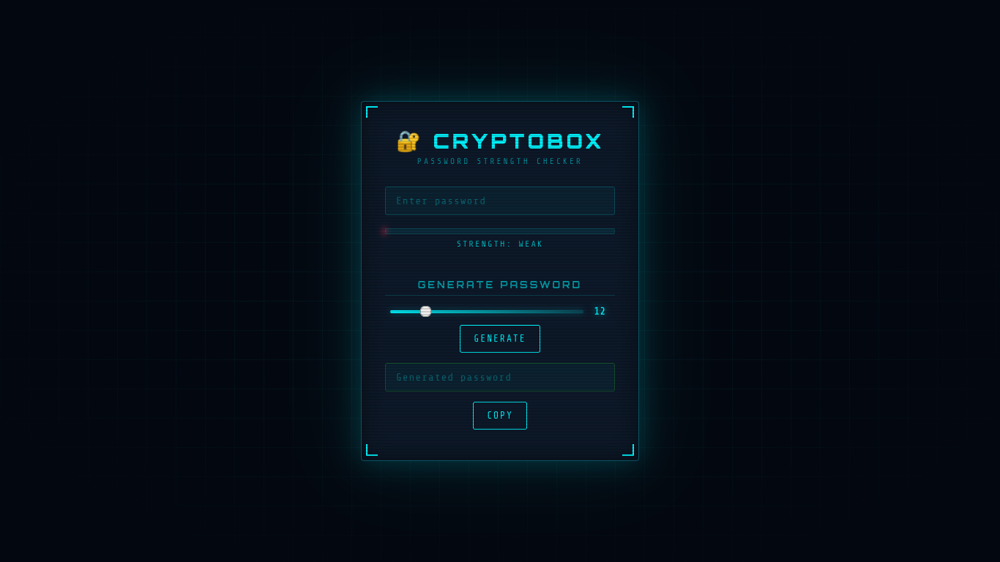

# 🔐 CryptoBox — Password Strength Checker

## 📌 Overview

CryptoBox is a security-focused web application designed to evaluate password strength using multiple real-world factors.
Instead of relying on simple length checks, it analyzes complexity, estimates cracking time, and warns users about commonly used passwords.

This project is built with a focus on understanding **how attackers evaluate weak passwords** and how users can improve password security.

---

## 🚀 Features

### 🔎 Password Strength Analysis

* Evaluates passwords based on:

  * Length
  * Uppercase & lowercase usage
  * Numbers and special characters
* Generates a **score (0–100)** and classifies:

  * Weak
  * Medium
  * Strong

---

### ⏱️ Crack Time Estimation

* Provides an estimated time required to crack the password
* Helps users understand real-world risk:

  * Weak → seconds/minutes
  * Medium → hours/days
  * Strong → years

---

### ⚠️ Common Password Detection

* Checks passwords against a list of commonly used passwords
* Warns users if their password is easily guessable

---

### 🔑 Secure Password Generator

* Generates strong random passwords
* Uses **Web Crypto API (`crypto.getRandomValues`)**
* Adjustable length (8–32 characters)
* Includes:

  * Letters
  * Numbers
  * Symbols

---

### 📋 Copy to Clipboard

* One-click copy for generated passwords

---

## 🛠️ Tech Stack

* HTML5
* CSS3 (Dark UI + animations)
* JavaScript (Vanilla)
* Web Crypto API

---

## 🧠 Key Learning Outcomes

* Understanding password strength evaluation
* Basics of entropy and brute-force attacks
* Secure random number generation
* Real-world password vulnerabilities
* UI/UX for security tools

---

## 📸 Screenshots

[](assets/live.png)

---

## 🌐 Live Demo


🔗 Open Project: [CryptoBox Live](https://nafee7h.github.io/Cybrexa_02_CryptoBox/)

---

## 📂 Project Structure

```
CryptoBox/
│
├── index.html
├── style.css
├── script.js
├── README.md
```

---

## ⚠️ Limitations

* Uses a small dataset for common password detection
* Crack time estimation is approximate (not exact brute-force calculation)
* No external breach API integration (yet)

---

## 🔮 Future Improvements

* Integrate HaveIBeenPwned API
* Advanced entropy-based calculations
* Password history check
* UI improvements and animations
* Dark/Light mode toggle

---

## 💡 Conclusion

CryptoBox is a beginner-to-intermediate level project that demonstrates how password security works from both a user and attacker perspective.
It highlights the importance of strong passwords and provides practical tools to improve them.

---

## 🔗 Connect

If you're interested in cybersecurity and web security, feel free to connect and collaborate.

---

#CyberSecurity #WebSecurity #JavaScript #PasswordSecurity #BugBounty
